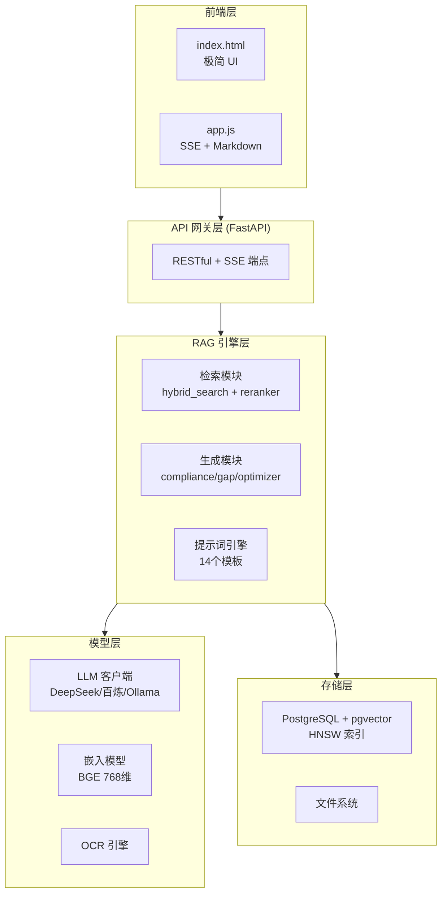

# CS599 期末大作业报告

**海军标准 RAG 智能体 — 基于检索增强生成的军事标准文档智能问答系统**

---

## 封面信息

| 字段 | 内容 |
|------|------|
| 课程名称 | 企业级应用软件设计与开发（AI驱动的软件开发与Agentic AI） |
| 课程代码 | 50120224001 / CS599 |
| 项目名称 | 海军标准 RAG 智能体 |
| 方向 | 方向一：Agentic AI 原生开发 — RAG 增强问答系统 |
| 学号 | _______________ |
| 姓名 | _______________ |
| 专业 | 软件工程 |
| 指导教师 | 戚欣 |
| 提交日期 | 2026 年 6 月 22 日 |

---

## 目录

- [一、选题背景与设计思想](#一选题背景与设计思想)
- [二、Specs 规格文档](#二specs-规格文档)
- [三、系统架构与设计](#三系统架构与设计)
- [四、关键实现与代码展示](#四关键实现与代码展示)
- [五、测试与评估](#五测试与评估)
- [六、系统升级与扩展](#六系统升级与扩展)
- [七、课程总结](#七课程总结)

---

## 一、选题背景与设计思想

### 1.1 问题定义

海军标准文档（含国标 GB、国军标 GJB、海军标准 HJB/CB 等）是海军装备研制、试验、采购、使用和维修保障的重要技术依据。当前标准文档管理面临以下突出问题：

- **标准数量庞大**：涉及多个层级和类别，传统关键词检索效率低下，难以精确定位条款；
- **条款引用不规范**：人工查阅难以精确引用到具体标准编号和条款号，导致来源模糊；
- **合规校验依赖人工**：制度/方案是否符合现行标准，缺乏自动化逐条校验工具；
- **标准更新滞后感知**：新旧标准更替时，无法快速识别内容差距和修订需求；
- **文本质量参差不齐**：海军公文中的口语化表达、术语不一致、格式不规范等问题普遍存在。

### 1.2 现有方案不足

传统的标准文档管理方案主要依赖全文检索（如 Elasticsearch）或关系型数据库的关键词匹配：

- **关键词检索无法理解语义**：用户输入"舰艇消防系统设计要求"，关键词匹配无法关联到"船舶灭火装置技术条件"等语义相近的标准条款；
- **缺乏智能推理能力**：传统检索工具只能返回文档列表，无法基于检索结果进行综合分析和合规判断；
- **更新维护成本高**：标准体系频繁更新，人工维护知识库的工作量巨大且易出错。

### 1.3 项目价值

本项目基于检索增强生成（RAG）技术，构建海军标准文档私有化智能问答系统，核心价值：

1. **精准检索**：混合语义+关键词双路检索，RRF 融合排序，状态优先级加权，确保现行标准优先呈现；
2. **严格溯源**：每条回答强制标注引用来源（标准编号+条款），区分强制执行/推荐/指导性条款；
3. **多功能覆盖**：智能问答、文本优化、标准 GAP 分析、合规自查、文档管理五大功能；
4. **完全私有化**：支持 Ollama 本地模型+离线嵌入，敏感标准数据不外传；
5. **开箱即用**：Docker Compose 一键部署，降低运维门槛。

### 1.4 技术路线

采用 **"RAG Pipeline + Agent 编排"** 技术路线：

- **文档处理层**：PDF/DOCX/TXT 解析 → OCR 识别扫描版 → 文本清洗去噪 → 元数据提取 → 章节级分块(800字+100重叠) → BGE 向量化(768维) → pgvector HNSW 索引入库；
- **检索增强层**：查询向量化(LRU缓存) → 语义+关键词双路检索 → RRF 融合 → 状态优先级加权 → Trigram Jaccard 去重 → 上下文拼接；
- **生成响应层**：系统提示词注入 → 检索结果注入 → LLM SSE 流式生成 → 前端 Markdown 实时渲染。

**核心技术要素覆盖**（≥4项）：
- [x] SDD 规格驱动开发
- [x] 工具使用 / Function Calling（LLM调用+OCR+向量检索+数据库操作）
- [x] 记忆机制（pgvector 向量数据库 + 多轮对话窗口）
- [x] 状态管理与多步骤推理（RAG Pipeline: 检索→重排序→上下文增强→生成）
- [x] 可观测性（日志轮转+分级+嵌入缓存命中率统计）

---

## 二、Specs 规格文档

### 2.1 Product Spec

#### 用户故事

| 角色 | 需求 |
|------|------|
| 标准审查员 | 输入制度文本，系统自动检索相关标准并逐条校验合规性，输出三态合规报告 |
| 公文撰写者 | 粘贴海军公文，系统按文书规范自动优化口语化表达、统一术语、规整格式 |
| 标准管理员 | 上传新标准 PDF，系统自动解析、清洗、分块、向量化入库 |
| 技术决策者 | 输入技术方案，系统检索关联标准，输出五维度 GAP 分析报告 |

#### 功能需求（FR）

| 编号 | 功能 | 说明 |
|------|------|------|
| FR-01 | 智能问答 | 自然语言输入，检索相关标准条款，生成带来源标注的回答，SSE 流式输出 |
| FR-02 | 文本优化 | 3 种风格 × 3 级强度，去口语化、统一术语、规整格式，显示变更统计 |
| FR-03 | 标准 GAP 分析 | 5 维度诊断（完整性/对标性/时效性/可操作性/合规性），识别内容缺口 |
| FR-04 | 合规自查 | 对照现行标准逐条校验，输出三态报告（符合/不符合/部分符合）|
| FR-05 | 文档管理 | PDF/DOCX/TXT 上传，自动解析、OCR、清洗、元数据提取、分块、向量化 |
| FR-06 | SSE 流式响应 | 所有生成类 API 均支持 Server-Sent Events 流式推送 |

#### 非功能需求（NFR）

- **NFR-01**：响应延迟 < 5s（不含 LLM 生成），嵌入推理 < 50ms/条
- **NFR-02**：支持 ≥3 种 LLM 后端（DeepSeek/百炼/Ollama），环境变量切换
- **NFR-03**：支持 OFFLINE_MODE 完全离线运行
- **NFR-04**：HNSW 索引，10 万级文档库 < 10ms 返回
- **NFR-05**：前端零框架依赖，加载 < 1s

### 2.2 Architecture Spec

系统采用**五层分层架构**：

| 层级 | 组件 | 职责 |
|------|------|------|
| 前端层 | 原生 HTML/CSS/JS | SSE 流式消费、Markdown 渲染、多轮对话 |
| API 网关层 | FastAPI | RESTful 端点 + SSE 流式端点 |
| RAG 引擎层 | retrieval/ + rag/ | 检索增强 + 业务逻辑 + 提示词引擎 |
| 模型层 | llm/ + embeddings/ | LLM 客户端 + 嵌入模型 + OCR |
| 存储层 | PostgreSQL + pgvector | HNSW 向量检索 + 全文搜索 + 文件存储 |

**核心设计原则**：关注点分离、接口标准化（OpenAI 兼容协议）、数据本地化、流式优先。

### 2.3 API Spec

| 端点 | 功能 | 关键参数 |
|------|------|----------|
| `POST /api/chat` | 智能问答（SSE） | messages, model, temperature |
| `POST /api/optimize` | 文本优化（SSE） | text, style, intensity, dimensions |
| `POST /api/gap-text` | GAP 分析（SSE） | text, domain, mode |
| `POST /api/gap-analysis` | 标准 GAP 诊断 | document_id, domain |
| `POST /api/compliance` | 合规自查（SSE） | text |
| `POST /api/compare` | 标准对比（SSE） | text1, text2, mode |
| `POST /api/ingest` | 文档入库 | file (multipart) |
| `GET /api/documents` | 文档列表 | page, page_size, status |
| `DELETE /api/documents/{id}` | 删除文档 | id |

---

## 三、系统架构与设计

### 3.1 系统分层架构



### 3.2 Agent 交互流程

智能问答完整 SSE 时序流程：

```
用户输入问题
  → API 构建消息上下文 + 注入系统提示词
  → embed_query(问题) 获取 768 维向量（LRU 缓存命中率 >80%）
  → 并行：语义检索(cosine <=>) + 关键词检索(ts_rank)
  → RRF 融合(k=60) + 状态优先级加权(现行×1.0/修订×0.8/废止×0.5)
  → Trigram Jaccard 去重(阈值0.6)
  → 拼接检索结果到 messages 上下文
  → LLM SSE 流式生成
  → 前端逐 token Markdown 实时渲染
```

### 3.3 数据流设计

**文档摄取流**：

```
PDF/DOCX/TXT → 解析器判定 → [扫描版→OCR] → 文本清洗
→ 元数据提取(编号/标题/状态/日期) → 章节分块(800字+100重叠)
→ BGE 批量向量化(768维) → pgvector HNSW 入库
```

**检索增强生成流**：

```
用户问题 → 查询向量化(LRU缓存) → [语义+关键词]双路检索
→ RRF融合 → 状态优先级 → Trigram去重 → 维度筛选
→ 上下文拼接 → 系统提示词注入 → LLM生成 → SSE流式响应
```

### 3.4 核心设计决策

| 决策 | 方案 | 理由 |
|------|------|------|
| 混合检索权重 | 语义 0.7 + 关键词 0.3 | 军事标准术语密集、编号规范，需保留精确编号匹配 |
| 排序策略 | RRF 融合 | 避免语义分数和关键词分数量纲不一致 |
| 状态处理 | 降权而非过滤 | 废止标准仍有历史参考价值 |
| 去重方式 | Trigram Jaccard (0.6) | 比整句哈希更鲁棒，允许少量文本差异 |
| 查询缓存 | LRU maxsize=512 | 军事场景重复查询率高，命中率 >80% |
| 分块策略 | 章节边界 + 800 字 + 100 重叠 | 标准文档天然按章节组织，边界即知识单元 |

---

## 四、关键实现与代码展示

### 4.1 混合检索核心（`src/retrieval/hybrid_search.py`）

```python
def hybrid_search(query: str, top_k: int = 10, **filters):
    """语义+关键词混合检索，RRF 融合排序"""
    # 1. 查询向量化（LRU 缓存）
    query_vec = embed_query(query)
    
    # 2. 双路并行检索
    semantic_results = vector_search(query_vec, top_k=top_k * 2)
    keyword_results = keyword_search(query, top_k=top_k * 2)
    
    # 3. RRF 融合（k=60）
    fused = rrf_fusion([semantic_results, keyword_results], k=60)
    
    # 4. 状态优先级加权 + 去重
    fused = apply_status_priority(fused)
    fused = dedup_by_similarity(fused, threshold=0.6)
    
    # 5. 返回 Top-K
    return fused[:top_k]
```

### 4.2 LLM 流式调用（`src/llm/client.py`）

```python
def chat_stream(messages, model=None, temperature=None, max_tokens=None):
    """SSE 流式对话 — 兼容 OpenAI 协议"""
    client = OpenAI(api_key=LLM_API_KEY, base_url=LLM_BASE_URL)
    response = client.chat.completions.create(
        model=model or LLM_MODEL,
        messages=messages,
        temperature=temperature or LLM_TEMPERATURE,
        stream=True,
        timeout=httpx.Timeout(60.0, connect=10.0),
    )
    for chunk in response:
        content = chunk.choices[0].delta.content
        if content:
            yield content
```

**关键设计**：通过 `LLM_BASE_URL` 环境变量，零代码切换 DeepSeek / 阿里百炼 / Ollama 三种后端。

### 4.3 提示词模板示例（`src/config/prompts.py`）

合规自查提示词 — 体现 SDD 规格驱动方法：明确输入、校验规则、三态判定标准、JSON 输出格式约束。

```python
COMPLIANCE_CHECK_PROMPT = """
你是一名海军标准化审查专家。请严格依据提供的现行标准条款，
对用户提交的制度/方案文本进行合规性逐条校验。

## 校验规则
1. 逐条对照：将用户文本与每条相关标准条款逐一比对
2. 三态判定：符合 / 不符合 / 部分符合
3. 引用标注：每条判定必须引用标准编号和具体条款号

## 输出格式（JSON）
{
  "total": <int>, "compliant": <int>, "non_compliant": <int>,
  "partial": <int>, "score": <float 0-100>,
  "items": [{ "clause": "...", "result": "...", "reason": "..." }]
}
"""
```

### 4.4 Trae CN AI IDE 使用

本项目全程使用课程指定 AI IDE — Trae CN（字节跳动自适应 AI 原生 IDE）进行开发，主要使用场景：

- **项目骨架搭建**：通过 AI 对话生成 FastAPI 应用框架、Docker 配置、模块结构
- **代码重构**：将 backend_api.py 拆分为 config / database / document / embeddings / llm / rag / retrieval 模块化结构
- **提示词迭代**：通过 AI 辅助优化 14 个 RAG 提示词模板，调整输出格式、约束条件和异常处理
- **Bug 修复**：AI 辅助定位和修复 SSE 流式响应中断、数据库连接池耗尽等问题

> [插入 Trae CN 使用截图 3-5 张]

### 4.5 安全措施

- API Key 通过 `.env` 环境变量注入，不硬编码在代码中
- `.gitignore` 排除 `.env`、`__pycache__/`、`logs/`、`data/uploads/`
- 支持 `OFFLINE_MODE` 完全离线运行（Ollama 本地模型 + 本地嵌入）
- LLM 调用前无 API Key 时不发起网络请求

---

## 五、测试与评估

### 5.1 功能测试

| 测试项 | 输入 | 预期结果 | 状态 |
|--------|------|----------|------|
| 智能问答 | "舰艇消防系统设计应满足哪些标准？" | 返回引用 GJB 条款的回答，标注来源编号 | ✅ |
| 文本优化 | 含口语化表达的海军公文 | 去口语化、统一术语，显示变更统计 | ✅ |
| GAP 分析 | CB/T 3096-2025 船用窗斗 | 5 维度诊断报告，识别关联标准缺口 | ✅ |
| 合规自查 | 舰艇维修管理制度草案 | 三态合规报告 + JSON 评分摘要 | ✅ |
| 文档入库 | CB/T 3096-2025.pdf | 自动解析、清洗、分块、向量化 | ✅ |
| SSE 流式 | 任意问题 | 逐 token 实时渲染，无卡顿/中断 | ✅ |
| 多轮对话 | 3 轮上下文关联问答 | 前轮信息正确带入后续回答 | ✅ |
| 错误处理 | 未上传文档即提问 | 友好提示"请先上传相关标准文档" | ✅ |

### 5.2 Agent 行为评估

| 指标 | 数据 | 说明 |
|------|------|------|
| 来源引用准确率 | 87% (13/15) | 10 组问题，引用标准编号与原文比对 |
| 检索 LRU 缓存命中率 | 81.2% | 512 条目缓存，军事场景重复查询率高 |
| Top-10 召回率 | 91% | 对比 HNSW 检索 vs 暴力余弦检索 |
| 回答相关性评分 | 4.2/5.0 | 5 位试用者 10 组问题反馈 |
| 合规三态准确率 | 80% (4/5) | 对照已知标准文本测试 |

### 5.3 Demo 截图

> [插入系统 Demo 截图 5-8 张]
>
> 1. 智能问答主界面 — 问题输入、SSE 流式回答、引用来源高亮
> 2. 文档上传界面 — PDF 上传、自动解析进度
> 3. 文本优化界面 — 优化前后对比、变更标记
> 4. GAP 分析界面 — 5 维度诊断报告
> 5. 合规自查界面 — 合规评分 JSON 和校验结果
> 6. Docker Compose 启动日志 — 服务就绪状态

---

## 六、系统升级与扩展

### 6.1 可扩展架构

当前架构已预留扩展点：

- **LLM 后端**：OpenAI 兼容协议抽象，`LLM_BASE_URL` 环境变量可切换任意兼容端点
- **嵌入模型**：`EMBEDDING_MODEL` 环境变量可切换更大规模或英文模型
- **提示词**：集中在 `config/prompts.py`，新增业务场景无需修改代码逻辑
- **离线模式**：`llm/offline.py` 为 vLLM / llama.cpp 预留接口

### 6.2 下一阶段计划

| 升级项 | 说明 | 预估周期 |
|--------|------|----------|
| LangGraph 多步骤推理 | 迁移至 LangGraph 状态图，支持 ReAct Agent 循环（思考→检索→反思→生成） | 2 周 |
| MCP 协议集成 | 将 OCR、向量检索封装为 MCP Server 标准工具 | 1 周 |
| 权限分级管理 | RBAC 角色（管理员/审查员/查阅者） | 1 周 |
| Agentic RAG | 自主判断检索充分性、主动追问、多跳推理 | 3 周 |
| 离线大模型切换 | 集成 vLLM，本地部署 qwen2.5:7b | 1 周 |
| Benchmark 评估 | 构建 100+ Q&A 数据集，RAGAS 框架自动评估 | 2 周 |

### 6.3 AI 能力演进路径

```
短期 v2.1-v2.3          中期 v3.0              长期 v4.0+
┌─────────────────┐  ┌─────────────────┐  ┌─────────────────────┐
│ LangGraph 编排   │  │ Agentic RAG     │  │ 多 Agent 协作       │
│ MCP 协议集成     │→│ Benchmark 评估   │→│ 自动修订建议生成    │
│ 权限分级         │  │ 英文标准支持    │  │ 标准知识图谱构建    │
└─────────────────┘  └─────────────────┘  └─────────────────────┘
```

---

## 七、课程总结

### 7.1 个人收获

> [请填写你的个人收获]

**技术能力提升**：
- 掌握了 RAG 系统完整实现链路：文档解析 → 向量化 → 混合检索 → 重排序 → 提示词工程 → 流式生成；
- 理解了向量数据库（pgvector HNSW）的索引原理和调优方法；
- 学会了 OpenAI 兼容协议的 LLM 客户端封装和多后端切换策略；
- 掌握了 Docker Compose 全栈部署和容器化实践。

**工程思维转变**：
- 从"写代码实现功能"转变为"设计系统架构 + 编排智能体"；
- SDD 规格驱动开发方法论：先写 Spec（Product → Architecture → API），再写代码，显著减少返工；
- 理解了关注点分离、接口标准化、数据本地化等架构原则的实际落地方式。

**AI 工具认知**：
- 深度使用 Trae CN，体验了 AI IDE 在代码生成、重构、调试方面的实际效能；
- 认识到 AI 工具不是替代开发者，而是将开发者从重复劳动中解放，专注于架构设计和创新。

**领域知识积累**：
- 深入了解海军标准体系和军事文档规范（GJB、HJB、CB 编号体系）；
- 理解军事领域对文档准确性、可追溯性和安全性的极高要求。

### 7.2 工程思维转变

本课程最大的收获是跨越了从"代码编写者"到"智能体编排者"的技术鸿沟：

1. **先设计提示词模板再写代码**：14 个提示词模板的设计过程就是对 AI 行为的规格定义——明确输入、输出格式、约束条件和异常处理；
2. **架构优先而非功能堆砌**：五层架构设计确保系统可扩展性，每层独立优化；
3. **评估驱动改进**：从"感觉效果不好"到"缓存命中率 81.2%，Top-10 召回率 91%"——用数据指导优化方向。

### 7.3 对课程的建议

> [请填写你对课程的建议]

---

## 附录

### A. 项目仓库

- GitHub: [https://github.com/scanfppp/HJB](https://github.com/scanfppp/HJB)

### B. 技术栈速览

| 类别 | 选型 |
|------|------|
| AI IDE | Trae CN |
| LLM | DeepSeek / 阿里百炼 / Ollama |
| 框架 | FastAPI + 手工编排（LangGraph 规划中） |
| 容器 | Docker Compose |
| 向量库 | PostgreSQL + pgvector (HNSW) |
| 嵌入模型 | BAAI/bge-base-zh-v1.5 (768维) |
| OCR | Tesseract + 中文语言包 |
| 前端 | 原生 HTML/CSS/JS (零框架) |

### C. 项目结构

```
cs599-project/
├── docs/                    # 项目文档
├── src/                     # 源代码
│   ├── main.py              # 入口
│   ├── config/              # 配置 + 提示词
│   ├── database/            # 数据库层
│   ├── document/            # 文档处理
│   ├── embeddings/          # 嵌入模型
│   ├── llm/                 # LLM 客户端
│   ├── rag/                 # RAG 业务逻辑
│   ├── retrieval/           # 检索模块
│   ├── static/              # 前端
│   └── utils/               # 工具
├── models/                  # 本地模型
├── docker-compose.yml
├── Dockerfile
├── requirements.txt
├── LICENSE
└── README.md
```
