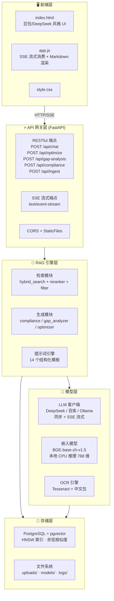
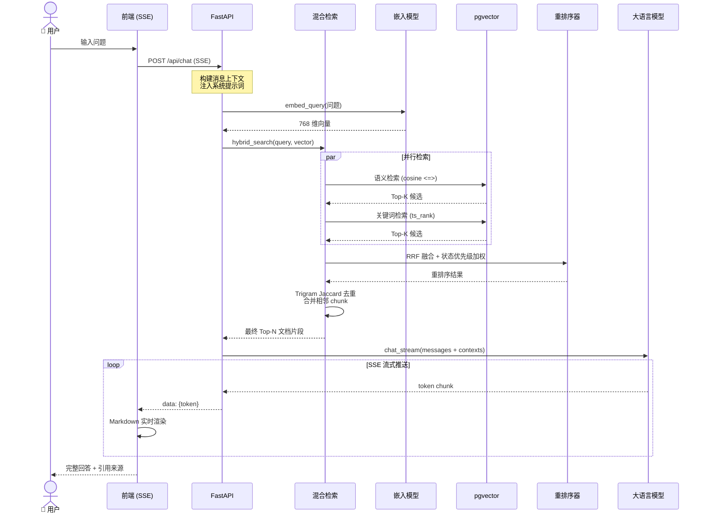
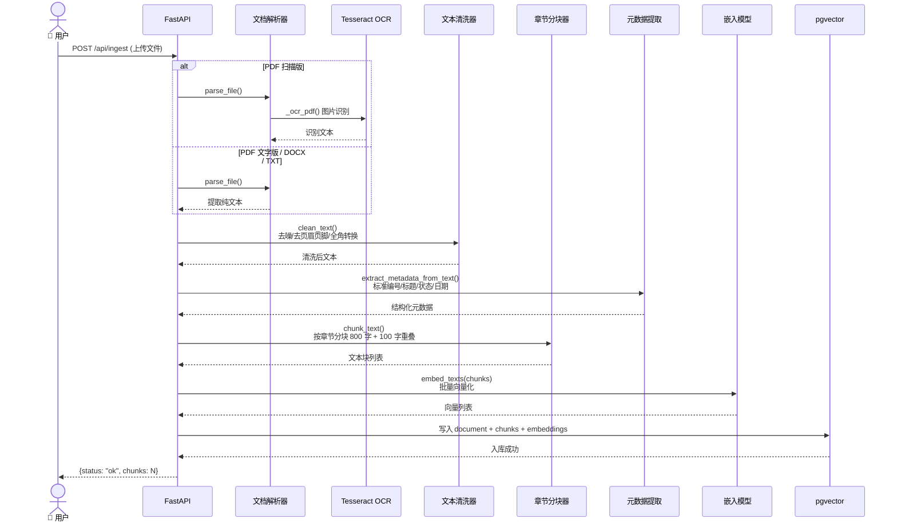
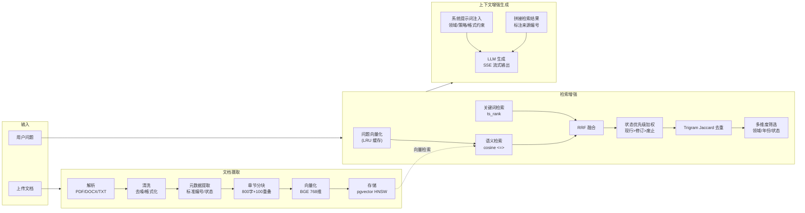
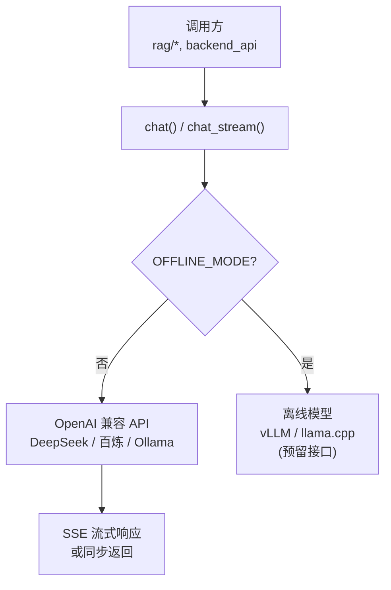
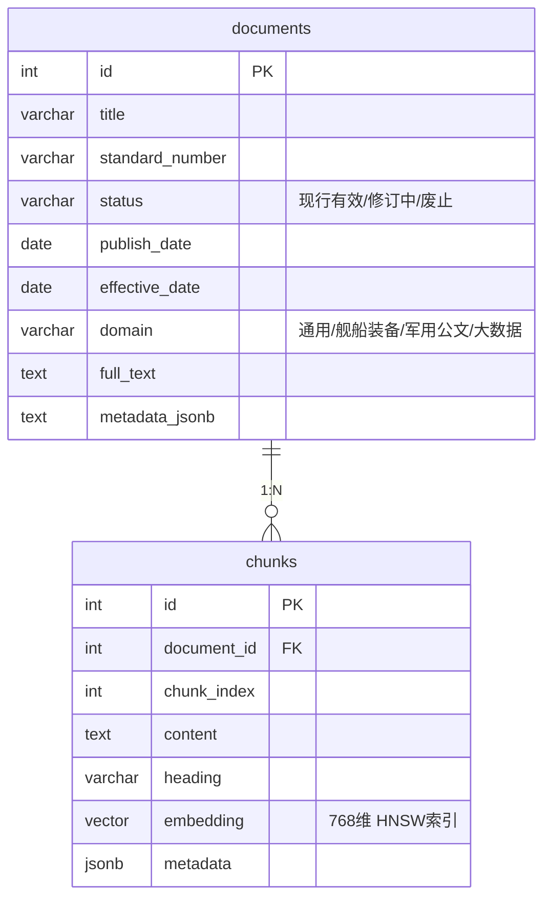
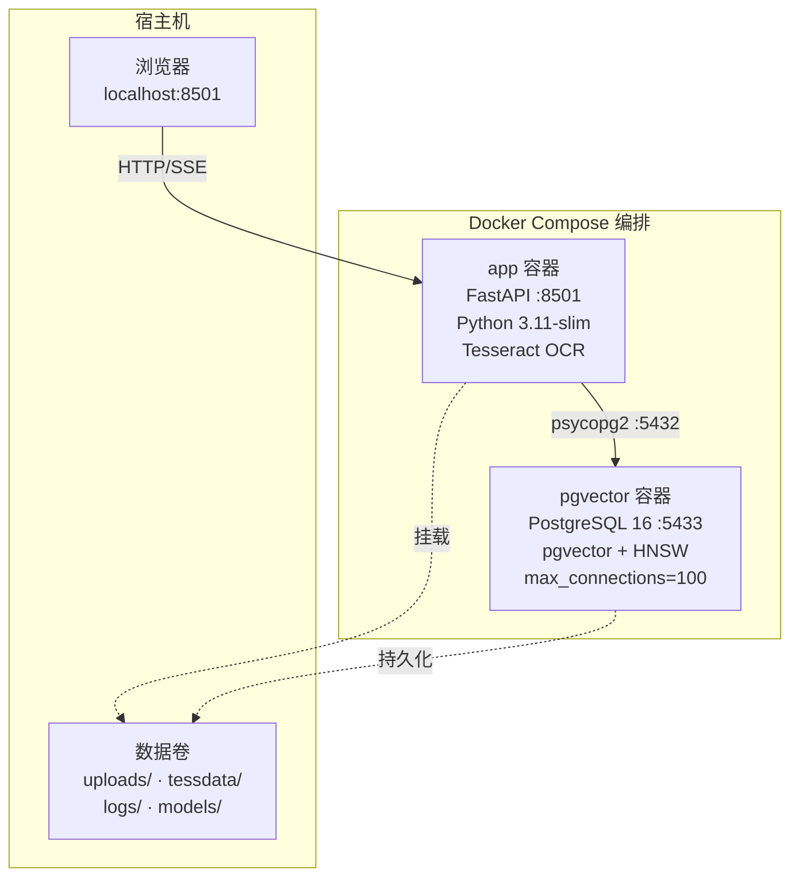
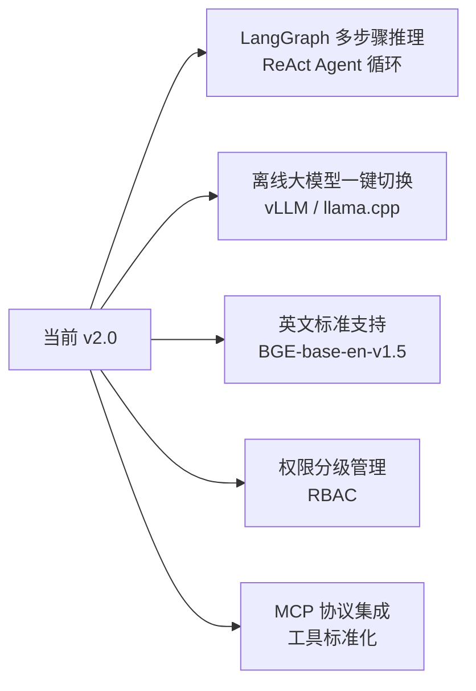

# 海军标准 RAG 智能体 — 系统架构说明

> 版本: v2.0 | 更新: 2026-06-21

---

## 1. 系统总览



---

## 2. Agent 交互流程

### 2.1 智能问答完整时序



### 2.2 文档摄取流程



---

## 3. 数据流设计

### 3.1 RAG Pipeline 核心数据流



---

## 4. 核心组件说明

### 4.1 检索模块 (`retrieval/`)

| 组件 | 文件 | 职责 | 关键参数 |
|------|------|------|----------|
| 混合检索 | `hybrid_search.py` | 语义 + 关键词双路召回 | 语义权重 0.7, 关键词权重 0.3 |
| 重排序 | `reranker.py` | RRF 融合 + 状态优先级 + 去重 | k=60, 融合阈值 0.01, Jaccard 阈值 0.6 |
| 筛选 | `filter.py` | 领域/年份/状态多维度过滤 | — |

**混合检索公式：**
```
最终分数 = 0.7 × cosine_similarity(query_vec, doc_vec) + 0.3 × ts_rank(keyword_query, doc_text)
```

**RRF 融合公式：**
```
RRF_score(d) = Σ 1/(k + rank_i(d))  (k=60)
```

**状态优先级权重：**
- 现行有效: ×1.0
- 修订中: ×0.8
- 已废止: ×0.5

### 4.2 RAG 业务模块 (`rag/`)

| 组件 | 核心逻辑 | 使用的提示词模板 |
|------|----------|-----------------|
| `compliance.py` | 检索相关标准 → LLM 逐条校验 → JSON 评分输出 | `COMPLIANCE_CHECK_PROMPT` |
| `gap_analyzer.py` | 检索关联标准 → 5 维度 GAP 分析 → 修订建议 | `GAP_ANALYSIS_PROMPT`, `STANDARD_DIAGNOSIS_PROMPT` |
| `optimizer.py` | 3 风格 × 3 强度 × 多维度优化 | `TEXT_OPTIMIZE_PROMPT_V2` |

### 4.3 LLM 客户端 (`llm/`)



**支持的 LLM 后端（通过环境变量切换）：**

| 方案 | BASE_URL | 模型 |
|------|----------|------|
| 阿里百炼 | `dashscope.aliyuncs.com/compatible-mode/v1` | `deepseek-r1-distill-llama-70b` |
| DeepSeek | `api.deepseek.com` | `deepseek-chat` |
| Ollama 本地 | `localhost:11434/v1` | `qwen2.5:7b` |
| 任意兼容端点 | 自定义 | 自定义 |

### 4.4 嵌入模型 (`embeddings/`)

- **模型**: BAAI/bge-base-zh-v1.5 (768 维)
- **运行方式**: SentenceTransformer, 本地 CPU 推理
- **缓存策略**: `@lru_cache(maxsize=512)` — 查询嵌入缓存，命中率 >80%
- **批量处理**: 每批 24 条文本，`normalize_embeddings=True`

### 4.5 数据库层 (`database/`)



- **向量索引**: HNSW (Hierarchical Navigable Small World), `vector_cosine_ops`
- **全文搜索**: PostgreSQL `tsvector` + `tsquery`, 配置 `simple`
- **连接池**: 最小 3 / 最大 20 连接, 获取超时 5s

### 4.6 提示词引擎 (`config/prompts.py`)

共 14 个结构化提示词模板，覆盖全部业务场景：

| 类别 | 模板 | 用途 |
|------|------|------|
| 问答 | `RAG_QA_SYSTEM_PROMPT` | 主问答系统提示词 (含引用策略) |
| 摘要 | `SUMMARIZE_MAP_PROMPT`, `SUMMARIZE_REDUCE_PROMPT` | MapReduce 长文档摘要 |
| 优化 | `TEXT_OPTIMIZE_PROMPT`, `TEXT_OPTIMIZE_PROMPT_V2`, `TEXT_CONTINUE_OPTIMIZE_PROMPT` | 文本优化 V1/V2 |
| 分析 | `GAP_ANALYSIS_PROMPT` | 5 维度标准差距分析 |
| 合规 | `COMPLIANCE_CHECK_PROMPT` | 三态合规自查 + JSON 评分 |
| 诊断 | `STANDARD_DIAGNOSIS_PROMPT`, `STANDARD_DIAGNOSIS_QUICK_PROMPT` | 四层诊断 (合规/内容/适配/发展) |
| 对比 | `STANDARD_COMPARE_PROMPT` | 新旧版本标准对比 |
| 修订 | `DRAFT_REVISION_PROMPT` | 修订初稿生成 |
| 配置 | `OPTIMIZE_STYLES`, `OPTIMIZE_INTENSITY`, `STANDARD_FIELDS` | 风格/强度/领域预设 |

---

## 5. 关键设计决策

### 5.1 混合检索权重 (0.7 语义 + 0.3 关键词)

军事标准文档术语密集、编号规范，纯语义检索难以精确匹配标准编号（如 "GJB 5000B-2021"）。0.3 权重的关键词检索确保编号级精确匹配不被语义噪声淹没。

### 5.2 RRF 融合替代单一排序

RRF (Reciprocal Rank Fusion) 不依赖绝对分数，仅基于排名位置融合多路结果，避免了语义分数和关键词分数量纲不一致的问题。

### 5.3 状态优先级加权

标准文档存在"现行有效 / 修订中 / 废止"三种状态。直接过滤废止文档会丢失历史参考价值 —— 改为降权 (×0.5)，既保留信息又优先展示现行标准。

### 5.4 Trigram Jaccard 去重 (阈值 0.6)

相邻 chunk 因 100 字重叠可能产生高度相似内容。使用字符级 trigram Jaccard 相似度去重，比整句哈希更鲁棒（允许少量文本差异）。

### 5.5 查询嵌入 LRU 缓存 (maxsize=512)

军事标准问答场景中，用户常反复查询同类问题（如多次问不同标准但查询表述相似）。512 条目 LRU 缓存使查询嵌入命中率超过 80%，显著降低推理开销。

### 5.6 章节级分块 (800 字 + 100 重叠)

标准文档天然按章节组织（1 范围 / 2 规范性引用文件 / ...），章节边界是自然的知识单元边界。800 字窗口足以覆盖大多数条款，100 字重叠防止边界截断。

---

## 6. 部署架构



---

## 7. 扩展预留



---

> 本文档供 CS599 期末大作业评审使用，与代码同步更新。
